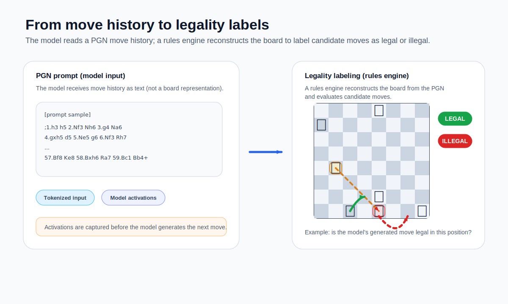
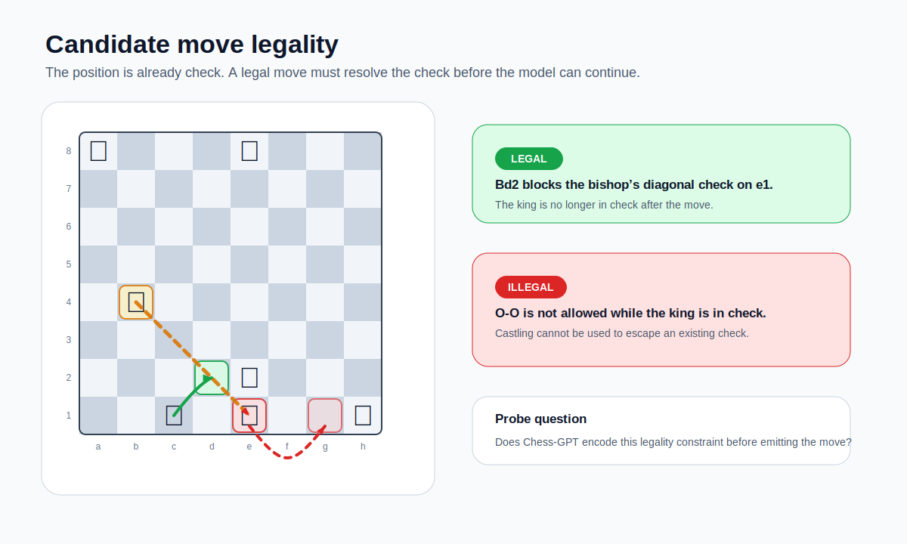
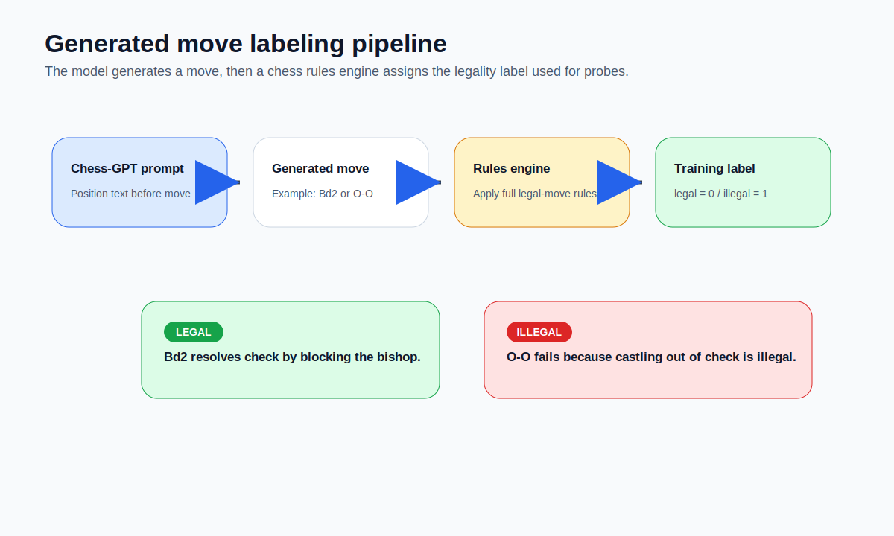
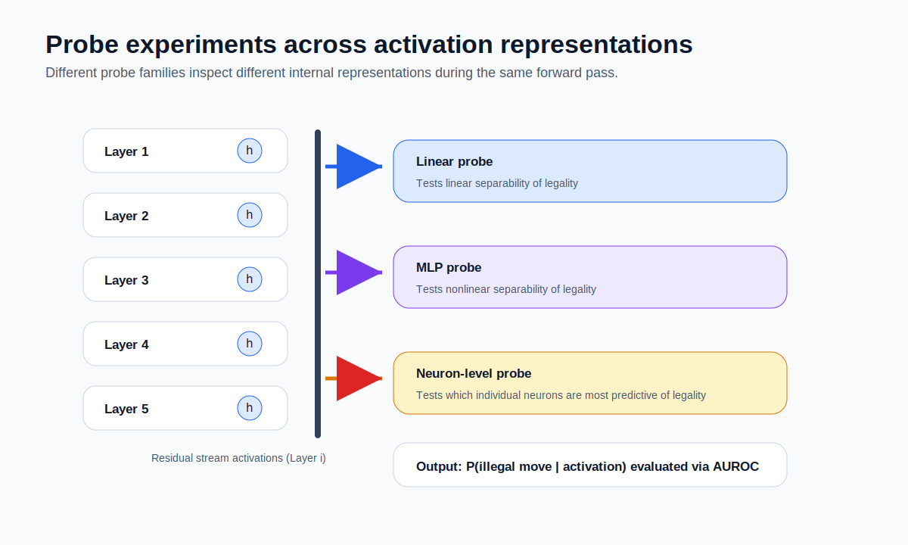
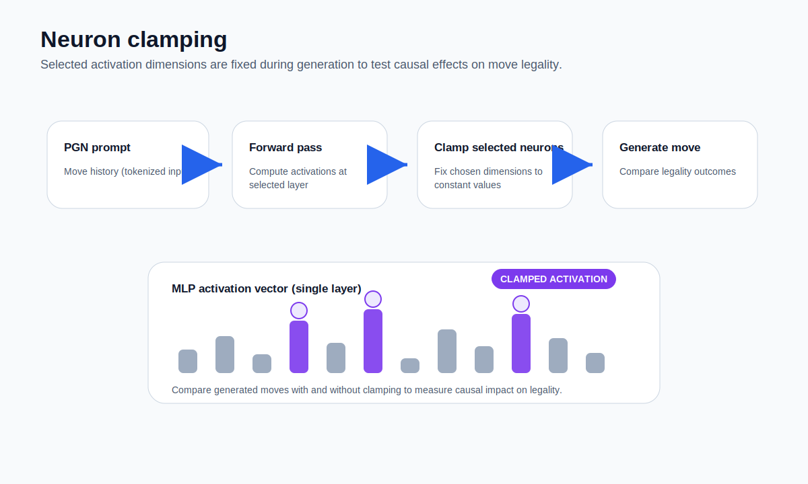

# Chess Legality Probe

## Overview

We study whether Chess-GPT's internal activations contain
information about whether its next generated chess move will be legal.

The workflow is split into reusable stages:

1. Generate Chess-GPT self-play positions, candidate moves, legality labels,
   and cached activations.
2. Train probes on the fixed activation dataset.
3. Compare where legality information is easiest to decode: residual stream
   activations, nonlinear probes over the same activations, and MLP activation
   dimensions.
4. Run activation-clamping interventions on selected MLP activation dimensions
   to test whether perturbing those dimensions changes generated-move behavior.

The probes are diagnostic tools. Strong probe performance is evidence that
legality-related information is available in an activation space; it is not, by
itself, proof that a specific activation dimension definitively encodes legality
or that the model uses that dimension causally.

## What The Model Sees



Chess-GPT is prompted with PGN-style move history, and the
generator converts the current game into text such as:

```text
;1.e4 e5 2.Nf3 Nc6
```

The model receives this move-history prompt and generates the next move as
text. A chess rules engine reconstructs the board from the move history for
labeling, but the model input remains the PGN-style transcript.

## How Moves Are Generated And Labeled



For each self-play position, Chess-GPT samples a candidate next move from the
PGN-style prompt. The code extracts the first generated move token and
asks `python-chess` whether that move is legal in the reconstructed position.



Each saved example contains the prompt-derived position, the attempted move,
the binary legality label, and cached activations at the final prompt token.
The main target used by the probes is `is_illegal = 1 - is_legal`, so AUROC is
more informative than raw accuracy when illegal moves are rare.

## Probe experiments



## Residual-Stream Linear Probe

`chess_gpt_probe.py` trains a linear classifier on residual stream activations.
The dataset stores the residual stream after embedding and after each
transformer block, always at the final prompt token before the sampled move.

This answers a narrow question: at which layers is future move legality
linearly decodable from the residual stream?

## MLP Nonlinear Probe

`chess_gpt_mlp_probe.py` trains a small MLP probe on the same cached residual
stream activations. It uses the same labels and fold structure as the linear
probe, but allows a nonlinear decision boundary.

The comparison is intentionally conservative:

- linear probe: asks whether legality is linearly decodable from the residual
  stream
- MLP probe: asks whether the same residual-stream information becomes more
  accessible with a small nonlinear probe

Higher MLP AUROC should be described as a nonlinear decoding result, not as
proof that the model's own downstream computation uses the same classifier.

## Neuron-Level Probe On MLP Activations

The neuron extension captures post-GELU MLP activations for every transformer
block. `neurons-extension/chess_gpt_neuron_probe.py` trains linear probes on
those MLP activations block by block.

The script also ranks activation dimensions by the mean absolute magnitude of
their learned probe weights across folds. These ranked dimensions are useful
candidate features for inspection and intervention, but the ranking should not
be read as definitive evidence that individual neurons encode legality.

## Neuron/Activation Clamping Intervention



`neurons-extension/clamp_neurons_experiment.py` uses the ranked MLP activation
dimensions from `top_neurons.csv` and clamps selected dimensions during
generation. The hook modifies only the final-token MLP activations, matching
the activation position used by the probes.

The intervention is a causal test of whether perturbing selected activation
dimensions changes generated-move legality rates. Results should be interpreted
with care: a change under clamping is evidence that the perturbed activations
matter for this generation setup, but it does not by itself identify a clean,
human-interpretable legality neuron.

## Project Layout

- `generate_games.py`
  Generates PGN-prompted self-play examples, legality labels, and residual
  stream activations.

- `chess_gpt_probe.py`
  Trains residual-stream linear probes.

- `chess_gpt_mlp_probe.py`
  Trains nonlinear MLP probes on residual-stream activations.

- `chess_probe_common.py`
  Shared dataset schema and save/load helpers for residual-stream datasets.

- `neurons-extension/generate_games_with_neurons.py`
  Generates datasets with both residual stream activations and post-GELU MLP
  activations.

- `neurons-extension/chess_gpt_neuron_probe.py`
  Trains block-level probes on MLP activations and writes ranked activation
  dimensions by probe-weight magnitude.

- `neurons-extension/analyze_legality_directions.py`
  Compares residual-stream legality directions with neuron-level directions.

- `neurons-extension/clamp_neurons_experiment.py`
  Runs activation-clamping sweeps during generation.

- `neurons-extension/plot_neuron_results.py`
  Produces summary plots for residual, neuron-level, and direction-analysis
  outputs.

- `configs/generation.yaml`
  Dataset-generation defaults for the residual-stream pipeline.

- `configs/probe.yaml`
  Probe-training defaults for the residual-stream linear probe.

- `neurons-extension/configs/generation_neurons.yaml`
  Dataset-generation defaults for the neuron/MLP activation pipeline.

## Setup

Clone the companion Chess-GPT repository next to this project and install the
Python dependencies:

```bash
git clone https://github.com/adamkarvonen/chess_gpt_eval.git ../chess_gpt_eval
uv sync --python 3.12
```

Download a checkpoint from <https://huggingface.co/adamkarvonen/chess_llms>
and place it in:

```text
../chess_gpt_eval/nanogpt/out/
```

The commonly used checkpoint is:

```text
stockfish_16layers_ckpt_no_optimizer.pt
```

This repository depends on plain `torch` rather than a CUDA-specific wheel.
CPU and macOS users can use the default `uv sync`. CUDA users should install
the CUDA-enabled PyTorch build matching their system.

Verify the installed PyTorch build and available backends:

```bash
uv run --python 3.12 python -c "import torch; print(torch.__version__); print('mps:', torch.backends.mps.is_available()); print('cuda:', torch.cuda.is_available())"
```

The experiment scripts accept `--device auto`, `--device mps`,
`--device cpu`, and `--device cuda`. With `--device auto`, the code chooses:

```text
cuda -> mps -> cpu
```

## How To Run The Main Scripts

Generate a residual-stream dataset from `configs/generation.yaml`:

```bash
uv run python generate_games.py --config configs/generation.yaml
```

Override selected generation settings from the command line:

```bash
uv run python generate_games.py \
  --config configs/generation.yaml \
  --positions 80 \
  --output data/quicktest.pt
```

Run the residual-stream linear probe:

```bash
uv run python chess_gpt_probe.py \
  --config configs/probe.yaml \
  --per-fold-csv data/per_fold_t1p3_n30000.csv
```

Run the MLP nonlinear probe:

```bash
uv run python chess_gpt_mlp_probe.py \
  --dataset data/stockfish16_t1p3_n30000.pt \
  --device auto \
  --hidden 64 \
  --num-hidden-layers 1 \
  --dropout 0.1 \
  --epochs 50 \
  --batch-size 256 \
  --per-fold-csv data/per_fold_mlp_t1p3_n30000.csv
```

Generate a dataset that also includes MLP activations:

```bash
uv run python neurons-extension/generate_games_with_neurons.py \
  --config neurons-extension/configs/generation_neurons.yaml \
  --repo ../chess_gpt_eval
```

Run the neuron-level probe on MLP activations:

```bash
uv run python neurons-extension/chess_gpt_neuron_probe.py \
  --dataset data/stockfish16_t1p3_n30000_neurons.pt \
  --device auto \
  --per-fold-csv data/per_fold_neurons.csv \
  --top-neurons-csv data/top_neurons.csv \
  --top-k 20
```

Run direction analysis:

```bash
uv run python neurons-extension/analyze_legality_directions.py \
  --dataset data/stockfish16_t1p3_n30000_neurons.pt \
  --repo ../chess_gpt_eval \
  --residual-probe-layer 12 \
  --top-k 20 \
  --output data/direction_analysis.csv
```

Run the activation-clamping intervention:

```bash
uv run python neurons-extension/clamp_neurons_experiment.py \
  --dataset data/stockfish16_t1p3_n30000_neurons.pt \
  --repo ../chess_gpt_eval \
  --top-neurons-csv data/top_neurons.csv \
  --output data/clamp_sweep_results.csv \
  --eval-positions 2000 \
  --device auto
```

Generate neuron-extension plots:

```bash
uv run python neurons-extension/plot_neuron_results.py \
  --neuron-csv data/per_fold_neurons.csv \
  --residual-csv data/per_fold_t1p3_n30000.csv \
  --top-neurons-csv data/top_neurons.csv \
  --direction-csv data/direction_analysis.csv \
  --out plots/neurons
```

Because dataset generation is the expensive step, the intended pattern is to
keep generation configs fixed for a run and iterate on probe settings and
analysis scripts afterward.
