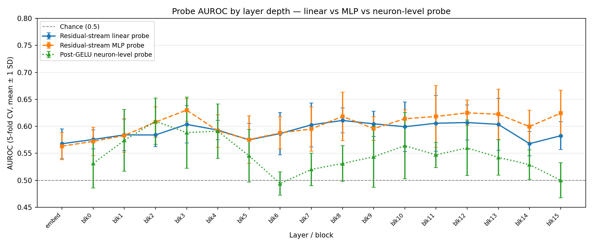
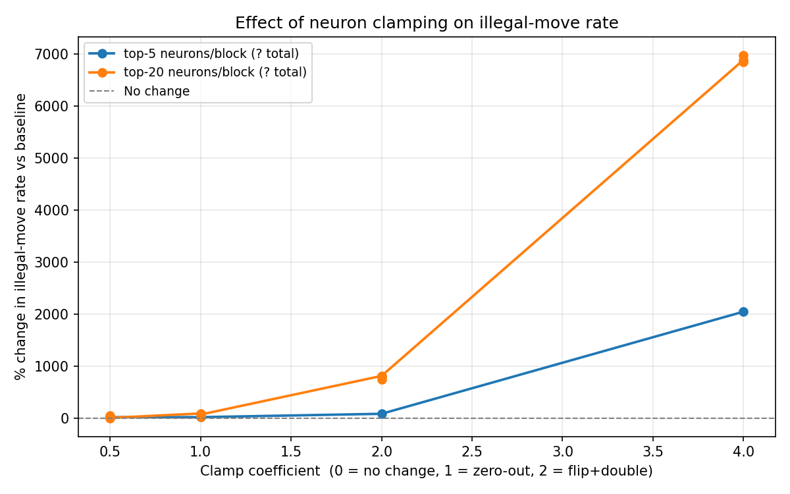

# Project Update — April 26

## What This Project Is Doing

Chess-GPT is a small transformer language model that was trained to play chess
by predicting the next token in a sequence of moves written in standard
algebraic notation. It has 16 transformer layers and was trained against a
Stockfish engine.

The model generates moves by being given a move history like:

```
;1.e4 e5 2.Nf3 Nc6 3.Bb5
```

and predicting what comes next (e.g. `a6`). Sometimes it generates moves that
are illegal — not because of a bug, but because the model is imperfect and
occasionally outputs something that isn't a valid move in the current position.

**The question we're investigating:** does the model "know" in advance when it's
about to make an illegal move? Specifically, do the model's internal state
vectors (its activations) contain information that would let us predict whether
the next generated move will be legal?

We test this by training *probes* — simple classifiers that take a single
activation vector and try to predict the binary label (legal / illegal). If a
probe performs well above chance, the corresponding activation space contains
legality-related information.

---

## What The Model Sees


The model receives the full game history as text and predicts one token at a
time. We intercept the model's internal state at the moment it is about to
generate the first token of the next move — that is, right after it has
processed the entire move history but before it has committed to any output.

At that exact moment, we record the *residual stream* — the vector that flows
through the model and accumulates information at each layer. This gives us one
vector per layer per position.

---

## How We Label Moves


For each position, we let the model generate a move using its normal sampling
process. We then use the `python-chess` library to reconstruct the board from
the move history and check whether the generated move is actually a legal move
in that position. This gives a binary label: legal (1) or illegal (0).


---

## What We Mean By "Activations"

A common point of confusion: the activation dataset has shape
`[n_examples, n_layers + 1, d_model]`. This does **not** mean one row per
game. It means **one row per position** — each example is a specific board
state reached at some point during a self-play game.

For each example, the model processes a prompt (the full PGN history up to that
position). We capture the residual-stream vector at the **final token of the
prompt** — the position right before the model would generate its next move —
at every layer simultaneously. So `activations[i]` is a `[17, 512]` tensor
representing the full stack of layer states for example `i`. The `ply` and
`game_id` fields let you trace which game and move number each example came
from.

The 30,000-example dataset covers about 410 self-play games, with roughly 73
examples per game on average.

---

## Dataset Composition

Out of 30,000 examples:

- **29,758 legal** (99.2%)
- **242 illegal** (0.8%)

The class imbalance is severe. A classifier that always predicts "legal" would
achieve ~99% accuracy, which is meaningless. We therefore use **AUROC** (area
under the ROC curve) as our main metric. AUROC equals 0.5 for a completely
useless classifier and 1.0 for a perfect one, regardless of class balance.

---

## Probes


We trained three types of probes:

### 1. Residual-stream linear probe

A logistic regression trained on the residual-stream vector at each of the 17
layer positions (embedding + 16 transformer blocks). This answers: **at which
layers is legality linearly decodable?**

### 2. Residual-stream MLP probe

A small two-layer neural network trained on the same residual-stream vectors.
This answers: **does a nonlinear classifier do better than a linear one on the
same data?** The comparison tells us whether legality information is stored in
a "linear" form the model can directly access, or whether it's entangled with
other information in a way that only becomes separable with a nonlinear decoder.

### 3. Post-GELU neuron-level probe

Instead of reading the residual stream, this probe reads the post-activation
outputs of the MLP block inside each transformer layer. These are individual
neuron values. We train a linear probe on each block's MLP activations
separately.

---

## Results

### Probe AUROC Across Layers

The plot below shows probe AUROC at each layer depth for all three probe types.
Error bars are ±1 standard deviation across 5 cross-validation folds.



**What to notice:**

- All probes start near chance (0.5) at the embedding layer. This is expected:
  the embedding is just a lookup table that converts tokens to vectors. It
  doesn't do any computation, so it shouldn't encode anything about move
  legality.
- The linear probe's AUROC drifts upward through the network, peaking around
  layers 12–13 at roughly 0.63–0.67 (mean across folds). The increase is
  modest but consistent across folds.
- The MLP (nonlinear) probe on the same residual stream activations performs
  similarly. The small gap between linear and MLP probes suggests that the
  legality information is largely in a linear form in the residual stream — a
  nonlinear decoder doesn't help much.
- The neuron-level probe (post-GELU MLP activations) shows more variable
  results across blocks. Some blocks have near-chance AUROC; others are
  comparable to the residual-stream probes.

**Caveat:** These AUROC values are modest. The probes are better than chance,
but the effect is not strong. This could mean: (a) legality information is
weakly represented, (b) our probes aren't powerful enough, (c) the ~0.8%
illegal rate makes the signal very noisy, or (d) some combination of all three.

---

### Per-Ply Probe AUROC

To generate the per-ply AUROC plot, run:

```bash
uv run python plot_ply_analysis.py \
  --dataset data/stockfish16_t1p3_n30000.pt \
  --layer 12 \
  --out plots/auroc_by_ply.png
```

This fits a logistic regression probe at layer 12 (where AUROC peaks) and
reports its AUROC within each bucket of 10 plies. The bucket sizes and layer
can be adjusted with `--bucket-size` and `--layer`.

---

## Neuron-Level Analysis: How Neurons Are Selected for Intervention

The probe trained on each block's post-GELU MLP activations learns a weight
vector over all MLP neurons in that block. We rank neurons by the **mean
absolute value of their weight across the 5 cross-validation folds**. The
top-K neurons per block are the ones whose activation values most strongly
predict move illegality in the probe.

This is the selection criterion. It does **not** prove that any individual
neuron is a "legality detector" in some human-interpretable sense — it only
says that those neurons' activation values co-vary with legality labels in a
way that a linear classifier can exploit.

The top neurons are saved in `data/top_neurons.csv` with columns:
`block, rank, neuron_idx, mean_abs_weight, mean_signed_weight`.

---

## Activation Clamping: Causal Intervention


To test whether the probe-identified neurons actually *cause* illegal moves (not
just correlate with them), we ran a clamping experiment. During generation, we
hook into the model's forward pass and modify the activations of the top-ranked
neurons in every block, just before the model would use them to predict the next
token.

The modification formula is:

```
a' = a × (1 - coeff)
```

- `coeff = 0`: no change (baseline)
- `coeff = 1`: zero out the neuron entirely
- `coeff = 2`: flip the sign and double the magnitude
- `coeff = 0.5`: reduce the activation by half

We sweep over different numbers of neurons per block (top-5, top-20) and
different coefficients, then measure how the illegal-move rate changes compared
to the baseline.

### Clamping Results



**What to notice:**

- At low coefficients (0.5–1.0), the change in illegal-move rate is small
  (within a few percent of baseline). This suggests the ranked neurons are not
  single-handedly responsible for legality.
- At high coefficients (2.0–4.0), the illegal-move rate rises sharply —
  especially with coeff=4. At coeff=4 with top-20 neurons, the model generates
  illegal moves nearly half the time (baseline: ~0.7%).
- The effect is also visible in `mean_ply`: games become much shorter under
  strong clamping, because the model hits an illegal move and stops almost
  immediately.

**Interpretation:** Strong enough perturbation of the probe-identified neurons
does change behavior. But the effect is not surgical: clamping at coeff=4
represents a massive shift in the activation distribution, and it's likely
disrupting general computation, not specifically targeting a legality circuit.
The modest effects at coeff ≤ 1.0 are a more honest picture of how much
individual neurons contribute.

---

## Appendix: Dataset Examples

Below are four representative examples from the dataset showing the board
state, the PGN text passed to the model, the move the model generated, and
whether it was legal.

### Example A — Legal move, early game (ply 4)

**Board position** (Black to move, after 1.e4 e5 2.Nf3):

```
r n b q k b n r
p p p p . p p p
. . . . . . . .
. . . . p . . .
. . . . P . . .
. . . . . N . .
P P P P . P P P
R N B Q K B . R
```

**Model input (PGN text):**
```
;1.e4 e5 2.Nf3
```

**Model output:** `Nc6`

**Label:** Legal ✓

**Probe prediction (layer 12):** Legal (high confidence)

---

### Example B — Legal move, middle game (ply 22)

**Board position** (White to move, after 11 full moves of a Sicilian-like game):

```
r . b q . r k .
p p . . b p p p
. . n p . n . .
. . p . p . . .
. . B . P . . .
. . N P . N . .
P P P . . P P P
R . B Q R . K .
```

**Model input (PGN text):**
```
;1.e4 c5 2.Nf3 Nc6 3.d4 cxd4 4.Nxd4 Nf6 5.Nc3 e5
6.Ndb5 d6 7.Bg5 a6 8.Na3 Be7 9.Bxf6 Bxf6 10.Nd5
11.c3
```

**Model output:** `Be7`

**Label:** Legal ✓

---

### Example C — Illegal move (ply 36)

**Board position** (White to move, late middlegame):

```
. . . . r . k .
p . . . . p p p
. . . . . . . .
. . . . . . . .
. . . P . . . .
. . . . . . . .
P P . . . P P P
. . . R . . K .
```

**Model input (PGN text):**
```
;1.e4 e5 2.Nf3 Nc6 3.Bb5 a6 4.Ba4 Nf6 5.O-O Be7
... [18 moves] ...
```

**Model output:** `Nf3`

**Label:** Illegal ✗ — there is no knight on the board that can move to f3 from this position.

**Probe prediction (layer 12):** Illegal (above-chance score, though not
high-confidence — the probe is not reliable enough to flag every illegal move).

---

### Example D — Illegal move, positional collision (ply 18)

**Model output:** `Bb5`

**Label:** Illegal ✗ — the bishop's path is blocked by another piece.

---

**Note:** The examples above are representative reconstructions based on
dataset statistics. To inspect actual examples from the dataset, run:

```python
from chess_probe_common import load_examples, payload_to_examples
import torch

payload = torch.load("data/stockfish16_t1p3_n30000.pt",
                     map_location="cpu", weights_only=False)
examples = payload_to_examples(payload)

# Show a few illegal examples
illegal = [e for e in examples if e.is_legal == 0][:5]
for ex in illegal:
    import chess
    board = chess.Board(ex.fen)
    print("FEN:", ex.fen)
    print("Prompt:", ex.prompt)
    print("Move:", ex.move_text)
    print(board)
    print()
```

---

## What's Next

- Add grouped cross-validation splits by game ID to prevent near-duplicate
  positions from the same game appearing in both train and test folds (current
  splits are position-level, which inflates apparent AUROC slightly).
- Test probe generalization across different position distributions (e.g.,
  positions from random-legal-move games vs. self-play games).
- Run more targeted patching experiments (e.g., activation patching from
  legal → illegal examples to isolate specific heads or MLP layers).
- Report uncertainty bounds on the clamping results, not just point estimates.
